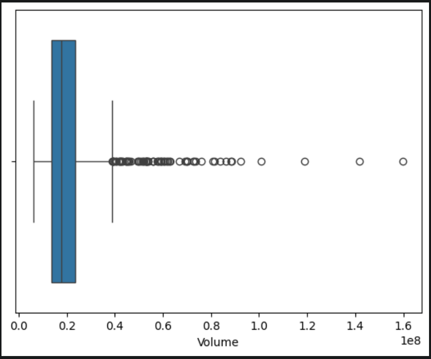

# Laporan Proyek Machine Learning - Aulia Afifah

## Domain Proyek

Pasar saham adalah salah satu indikator utama kondisi ekonomi, di mana harga saham mencerminkan ekspektasi investor terhadap kinerja masa depan suatu perusahaan. Alibaba Group Holding Limited (BABA) adalah salah satu perusahaan teknologi terbesar di dunia dengan kapitalisasi pasar yang besar dan pengaruh signifikan di pasar global. Menganalisis performa saham Alibaba dapat memberikan wawasan penting tentang tren pasar, sentimen investor, dan potensi pergerakan harga di masa depan. Pada proyek ini, kita akan melakukan predictive analytics terhadap saham Alibaba menggunakan data historis dari 1 Januari 2020 hingga 1 Mei 2024.

Analisis data saham Alibaba dapat membantu investor dalam membuat keputusan investasi yang lebih cerdas. Dengan memprediksi pergerakan harga saham, investor bisa meminimalkan risiko dan memaksimalkan keuntungan. Sebagai contoh, prediksi yang akurat dapat mengindikasikan kapan waktu terbaik untuk membeli atau menjual saham, sehingga memaksimalkan keuntungan investor [1]. Trader dapat menggunakan data historis untuk mengembangkan strategi perdagangan yang lebih efektif, seperti menentukan titik masuk dan keluar yang optimal berdasarkan pola harga masa lalu. Misalnya, analisis tren harga dan pola dapat memberikan wawasan tentang perilaku pasar dan membantu trader dalam mengatur strategi perdagangan yang lebih baik [2]. Menggunakan teknik analisis prediktif dan machine learning, kita bisa membangun model yang lebih akurat dalam memprediksi harga saham. Model prediktif yang akurat dapat membantu dalam berbagai aspek, mulai dari manajemen risiko hingga perencanaan investasi jangka panjang. Penelitian sebelumnya telah menunjukkan bahwa model machine learning seperti Random Forest, Decision Tree, Linear regresi, dan k-Nearest Neighbor (kNN) memiliki performa yang baik dalam memprediksi harga saham [3].

Referensi
[1] Suparti, S., & Santoso, R. Analisis Data Time Series Menggunakan Model Kernel: Pemodelan Data Harga Saham MDKA. Indonesian Journal of Applied Statistics, 6(1), 22-32.
[2] Riswan, A., & Mulyana, D. I. (2023). IMPLEMENTASI EXPERT ADVISOR UNTUK TRADING OTOMATIS FOREX MENGGUNAKAN INDIKATOR RSI DAN MA DENGAN METODE MARTINGALE DI PLATFORM METATRADER 4. Jurnal Indonesia: Manajemen Informatika dan Komunikasi, 4(3), 1463-1471.
[3] Waluyo, D. E., Kinasih, H. W., Paramita, C., Pergiwati, D., Nohan, R., & Rafrastara, F. A. (2024). Komparasi dan Implementasi Algoritma Regresi Machine Learning untuk Prediksi Indeks Harga Saham Gabungan. Jurnal Informatika: Jurnal Pengembangan IT, 9(1), 12-17.

## Business Understanding

Penelitian ini bertujuan untuk mengembangkan model prediktif yang dapat memprediksi harga penutupan saham Alibaba (Adj Close) dengan akurasi yang tinggi. Hasil dari penelitian ini diharapkan dapat memberikan berbagai manfaat signifikan dari sudut pandang bisnis dan ekonomi, serta memberikan dampak positif bagi berbagai stakeholder yang terlibat dalam pasar saham.

Manfaat dari Sudut Pandang Bisnis dan Ekonomi

1. Keputusan Investasi yang Lebih Baik: Dengan adanya model prediktif yang akurat, investor dan trader dapat membuat keputusan investasi yang lebih terinformasi. Prediksi yang akurat mengenai harga penutupan saham akan membantu mereka dalam mengidentifikasi waktu yang tepat untuk membeli atau menjual saham, memaksimalkan keuntungan, dan meminimalkan risiko.
2. Pemahaman Dinamika Pasar: Analisis faktor-faktor yang mempengaruhi harga saham Alibaba akan memberikan wawasan lebih dalam mengenai dinamika pasar. Investor dapat memahami kondisi pasar yang lebih baik dan menyesuaikan strategi investasi mereka berdasarkan informasi ini.
3. Efisiensi Pasar: Prediksi harga saham yang lebih akurat dapat meningkatkan efisiensi pasar dengan mengurangi asimetri informasi antara investor. Ini akan membuat harga saham lebih mencerminkan nilai fundamental perusahaan, yang pada akhirnya akan mengarah pada alokasi sumber daya yang lebih efisien di pasar saham.
4. Perencanaan Keuangan: Institusi keuangan dan manajer investasi dapat menggunakan model ini untuk merancang produk investasi yang lebih baik, mengelola portofolio dengan lebih efektif, dan merencanakan strategi keuangan jangka panjang.

Stakeholder dan Sasaran yang Dituju

1. Investor Individu: Orang-orang yang berinvestasi secara pribadi di pasar saham dan memerlukan alat bantu untuk membuat keputusan investasi yang lebih baik.
2. Trader Harian: Mereka yang melakukan transaksi saham dalam frekuensi tinggi dan membutuhkan prediksi harga saham dalam jangka pendek untuk mengambil keputusan cepat.
3. Manajer Investasi dan Hedge Funds: Profesional yang mengelola portofolio besar dan membutuhkan analisis mendalam serta prediksi yang akurat untuk strategi investasi mereka.
4. Lembaga Keuangan: Bank, perusahaan asuransi, dan lembaga keuangan lainnya yang memiliki eksposur signifikan terhadap pasar saham dan memerlukan model prediktif untuk manajemen risiko.

Penerapan Secara Aplikatif

1. Platform Investasi: Model prediktif ini dapat diintegrasikan ke dalam platform investasi dan trading yang digunakan oleh investor dan trader untuk memberikan prediksi harga saham secara real-time.
2. Laporan dan Analisis Pasar: Hasil analisis dan prediksi dapat dimasukkan ke dalam laporan pasar yang diterbitkan oleh perusahaan riset keuangan atau media ekonomi untuk memberikan wawasan kepada audiens yang lebih luas.
3. Sistem Manajemen Portofolio: Lembaga keuangan dapat mengintegrasikan model ini ke dalam sistem manajemen portofolio mereka untuk meningkatkan strategi alokasi aset dan manajemen risiko.

### Problem Statements

- Bagaimana cara memprediksi harga penutupan (Adj Close) saham Alibaba di masa depan?
  Investor dan trader memerlukan prediksi harga saham untuk membuat keputusan investasi yang lebih baik. Harga penutupan yang disesuaikan mencerminkan nilai riil saham setelah penyesuaian untuk dividen dan split saham, menjadikannya indikator yang penting.
- Apakah faktor-faktor yang paling mempengaruhi harga penutupan saham Alibaba?
  Mengetahui faktor-faktor yang mempengaruhi harga saham dapat membantu investor memahami dinamika pasar dan meningkatkan strategi investasi mereka.
- Bagaimana mengukur kinerja model prediksi harga saham dan memastikan model tersebut akurat dan dapat diandalkan?
  Mengetahui faktor-faktor yang mempengaruhi harga saham dapat membantu investor memahami dinamika pasar dan meningkatkan strategi investasi mereka.

### Goals

- Membangun model prediktif yang dapat memprediksi harga penutupan saham Alibaba dengan akurasi tertinggi: akan membantu investor dan trader dalam membuat keputusan investasi yang lebih tepat dan efektif.
- Mengidentifikasi dan menganalisis faktor-faktor utama yang mempengaruhi harga penutupan saham Alibaba: akan memberikan wawasan yang lebih dalam tentang faktor-faktor yang mempengaruhi harga saham dan bagaimana faktor-faktor tersebut dapat dimanfaatkan dalam strategi investasi.
- Mengembangkan metrik evaluasi untuk mengukur kinerja model prediksi dan melakukan validasi untuk memastikan keandalan model: memastikan bahwa model yang dikembangkan dapat diandalkan dan memberikan prediksi yang akurat.

### Solution statements

- Menggunakan beberapa algoritma untuk membangun model prediktif: KNN (K-Nearest Neighbors), Random Forest, dan Boosting.
- Menggunakan hasil evaluasi model: Dari hasil evaluasi, terlihat bahwa model RandomForest memiliki Train MSE yang paling rendah, menunjukkan performa yang baik dalam memprediksi harga penutupan saham Alibaba pada data pelatihan. Namun, performa pada data pengujian (Test MSE) serupa dengan model KNN. Model Boosting memiliki MSE yang lebih tinggi, menunjukkan performa yang kurang baik dibandingkan dua model lainnya.

## Data Understanding

Dataset yang digunakan dalam proyek ini adalah Alibaba (BABA) Stock Dataset yang tersedia di Kaggle. Dataset ini berisi data harga saham historis Alibaba Group Holding (BABA) dari 1 Januari 2020 hingga 1 Mei 2024. Data ini mencakup harga pembukaan, tertinggi, terendah, dan penutupan harian, serta harga penutupan yang disesuaikan dan volume perdagangan.
Sumber data: [Alibaba (BABA) Stock Dataset](https://www.kaggle.com/datasets/innocentmfa/alibaba-baba-stock-dataset?select=BABA.csv). Pada proyek ini akan melakukan predictive analytics terhadap Alibaba stock. Data yang digunakan adalah 1089 ribu.

### Variabel-variabel pada ulasan aplikasi DANA dataset adalah sebagai berikut:

Variabel-variabel pada Alibaba (BABA) Stock Dataset adalah sebagai berikut:

- Date: Tanggal data dicatat, mencerminkan setiap hari perdagangan.
- Open: Harga pembukaan saham pada hari itu.
- High: Harga tertinggi saham pada hari itu.
- Low: Harga terendah saham pada hari itu.
- Close: Harga penutupan saham pada hari itu.
- Adj Close: Harga penutupan yang disesuaikan (adjusted close), mencerminkan harga riil saham setelah penyesuaian untuk dividen dan split saham.
- Volume: Jumlah saham yang diperdagangkan pada hari itu.

Melakukan beberapa tahapan yang diperlukan untuk memahami data:

1. Informasi Umum tentang Data: Dari info dataset, kita dapat melihat jumlah entri dan tipe data masing-masing kolom. Dari 7 kolom, semuanya berisi data numerik. Sekarang, mari kita lanjutkan dengan analisis lebih mendalam tentang setiap variabel.
2. Statistik Deskriptif: Statistik deskriptif akan memberikan kita informasi tentang tendensi pusat dan sebaran data untuk setiap variabel numerik seperti Open, High, Low, Close, Adj Close, dan Volume. Ini akan membantu kita memahami distribusi dan karakteristik data.
3. Visualisasi Data dan Analisis Outliers: Membuat visualisasidata df dengan boxplot untuk mendeteksi outliers. Boxplot akan membantu kita mengidentifikasi outliers dalam variabel numerik. Outliers dapat memengaruhi analisis dan model prediktif, sehingga penting untuk mengetahui apakah mereka ada dan bagaimana mereka memengaruhi data.
   
   Gambar 1 menunjukkan contoh data yang tidak memiliki outliers. Pada boxplot tersebut, garis tengah kotak (median) berada di tengah kotak, sedangkan panjang kotak menunjukkan sebaran data di antara kuartil pertama (Q1) dan kuartil ketiga (Q3). Tidak ada titik di luar whiskers (garis yang menghubungkan kotak dengan titik-titik ekstrem), menunjukkan tidak adanya outliers.
   
   Gambar 2 menunjukkan contoh data yang memiliki outliers. Pada boxplot tersebut, terdapat titik-titik yang terletak di luar whiskers, menunjukkan adanya nilai-nilai ekstrem yang jauh dari sebagian besar data. Outliers ini bisa menjadi perhatian karena mereka dapat memengaruhi analisis dan model prediktif.

## Data Preparation

Pada bagian ini, berbagai teknik data preparation dilakukan untuk mempersiapkan dataset sebelum digunakan dalam proses pemodelan. Berikut adalah teknik-teknik yang digunakan:

1. Visualisasi Pairplot
   Visualisasi Pairplot digunakan untuk memahami hubungan antara variabel-variabel Open, High, Low, dan Close. Pairplot menghasilkan matriks scatterplot di mana setiap variabel dipasangkan dengan yang lainnya, sehingga memungkinkan untuk melihat pola korelasi antar variabel.
2. Principal Component Analysis (PCA)
   Principal Component Analysis (PCA) digunakan untuk mereduksi dimensi data dengan menjaga sebanyak mungkin variasi dari dataset asli. PCA digunakan di sini untuk mengurangi dimensi dari variabel Open, High, Low, dan Close menjadi satu variabel baru yang disebut "dimension".
3. Membagi Data menjadi Train dan Test Set
   Data dibagi menjadi dua set: set pelatihan (train set) dan set pengujian (test set). Set pelatihan digunakan untuk melatih model, sedangkan set pengujian digunakan untuk menguji kinerja model. Pembagian data ini dilakukan dengan proporsi tertentu, misalnya 90% data digunakan untuk pelatihan dan 10% untuk pengujian.
4. Standardisasi Fitur Numerik
   Fitur numerik, dalam hal ini dimensi, disesuaikan dengan standar skala menggunakan StandardScaler. Proses standardisasi ini menghasilkan fitur-fitur dengan mean 0 dan deviasi standar 1, sehingga memudahkan model dalam mempelajari pola dari data.

## Modeling

Model machine learning yang digunakan untuk memprediksi harga penutupan (Adj Close) saham Alibaba. Tiga algoritma yang digunakan adalah K-Nearest Neighbors (KNN), Random Forest, dan Boosting. Setiap model memiliki kelebihan dan kekurangan masing-masing, serta parameter tertentu yang mempengaruhi kinerjanya.

1. K-Nearest Neighbors (KNN)
   KNN adalah algoritma yang bekerja berdasarkan konsep bahwa data yang serupa cenderung berada dalam jarak yang dekat dalam ruang fitur. Pada tahap pelatihan, KNN menyimpan semua data pelatihan dan melakukan prediksi dengan menghitung rata-rata dari k-nearest neighbors untuk setiap data uji. Berikut adalah langkah-langkah yang dilakukan untuk menggunakan algoritma KNN:
1. Inisialisasi Model: Model KNN diinisialisasi dengan menentukan jumlah tetangga (k) yang akan digunakan dalam prediksi (melatih data dengan KNN dan menggunakan k = 10 tetangga dan metric Euclidean untuk mengukur jarak antara titik.).
1. Pelatihan Model: Model diberi data pelatihan (X_train dan y_train) untuk belajar pola dari data.
1. Prediksi: Model melakukan prediksi harga penutupan (Adj Close) untuk data pengujian (X_test) dengan mencari k-nearest neighbors dan menghitung rata-ratanya.
1. Evaluasi: Performa model dievaluasi menggunakan metrik evaluasi yang sesuai, dalam kasus ini, menggunakan Mean Squared Error (MSE).

1. Random Forest
   Random Forest adalah algoritma ensemble learning yang membangun beberapa pohon keputusan selama proses pelatihan dan menghasilkan prediksi berdasarkan hasil voting dari semua pohon keputusan. Langkah-langkah dalam menggunakan algoritma Random Forest adalah sebagai berikut:
1. Inisialisasi Model: Model Random Forest diinisialisasi dengan menentukan jumlah pohon (n_estimators) dan kedalaman maksimum setiap pohon (max_depth), serta parameter lainnya yang relevan (set n_estimator=50, kedalaman=16, dan n_jobs=-1 artinya semua proses berjalan secara paralel).
1. Pelatihan Model: Model diberikan data pelatihan untuk membangun pohon-pohon keputusan yang membentuk hutan acak.
1. Prediksi: Model melakukan prediksi harga penutupan untuk data pengujian dengan menggunakan hasil voting dari semua pohon keputusan.
1. Evaluasi: Performa model dievaluasi menggunakan metrik MSE.

1. Boosting (Adaboost)
   Boosting adalah teknik ensemble learning yang bekerja dengan membangun serangkaian model lemah (weak learners) dan meningkatkan kinerjanya dengan memperhatikan sampel yang salah dikenali oleh model sebelumnya. Adaboost adalah salah satu algoritma boosting yang populer. Berikut adalah langkah-langkah dalam menggunakan Adaboost:
1. Inisialisasi Model: Model Adaboost diinisialisasi dengan menentukan learning ratedan random state (bobot yang diterapkan pada setiap regressor di masing-masing proses iterasi boosting sebesar 0.05 dan mengontrol random number generator yang digunakan sebesar 55).
1. Pelatihan Model: Model Adaboost diberikan data pelatihan untuk membangun serangkaian model lemah.
1. Prediksi: Model melakukan prediksi harga penutupan untuk data pengujian dengan menggabungkan hasil prediksi dari semua model lemah.
1. Evaluasi: Performa model dievaluasi menggunakan metrik MSE.

Pemilihan Model Terbaik
Evaluasi Model
Setelah melatih ketiga model, dilakukan evaluasi menggunakan Mean Squared Error (MSE) pada data pelatihan dan pengujian. Hasil evaluasi ditampilkan dalam bentuk dataframe mse, yang memuat MSE untuk setiap model pada kedua set data.
Selanjutnya, dilakukan visualisasi perbandingan MSE untuk memudahkan pemahaman performa relatif dari setiap model.

Hasil Prediksi Contoh
Untuk memberikan gambaran tentang bagaimana setiap model memprediksi harga penutupan saham Alibaba, dilakukan prediksi untuk satu contoh data dari data pengujian. Hasil prediksi untuk setiap model ditampilkan dalam dataframe pred_dict.
Dari hasil evaluasi, model Random Forest memiliki MSE terendah pada kedua set data pelatihan dan pengujian, yang menunjukkan performa yang lebih baik dibandingkan dengan KNN dan Boosting. Oleh karena itu, Random Forest dipilih sebagai model terbaik untuk memprediksi harga penutupan saham Alibaba dalam proyek ini.

- K-Nearest Neighbors (KNN): algoritma non-parametrik yang menggunakan kedekatan data dalam ruang fitur untuk membuat prediksi.
  - Kelebihan: Mudah dipahami dan diimplementasikan dan Tidak memerlukan asumsi distribusi data.
  - Kekurangan: Kinerja bisa menurun pada dataset yang besar dan Sensitif terhadap skala fitur dan outliers.
- Random Forest: algoritma ensemble learning yang menggunakan banyak pohon keputusan untuk membuat prediksi.
  - Kelebihan: Dapat menangani data dengan fitur yang banyak dan saling berkorelasi dan Memberikan estimasi pentingnya fitur.
  - Kekurangan: Model yang besar bisa lambat untuk prediksi dan Cenderung overfitting jika tidak ada cukup data.
- Boosting (AdaBoost): teknik ensemble yang menggabungkan beberapa model lemah untuk membentuk model kuat.
  - Kelebihan: Meningkatkan akurasi model dengan mengurangi bias dan Efektif pada dataset dengan noise.
  - Kekurangan: Rentan terhadap overfitting jika tidak dikonfigurasi dengan baik dan Membutuhkan lebih banyak waktu untuk training.

## Evaluation

Dalam proyek ini, menggunakan Mean Squared Error (MSE) sebagai metrik evaluasi. MSE adalah pilihan yang tepat karena memberikan gambaran yang baik tentang seberapa baik model kita memprediksi harga penutupan saham Alibaba. MSE adalah metrik yang sangat umum digunakan dalam masalah regresi, termasuk prediksi harga saham. MSE menghitung rata-rata dari kuadrat selisih antara nilai yang diprediksi oleh model dan nilai sebenarnya.

1. KNN:

   - Train MSE: 0.001799
   - Test MSE: 0.002539

2. Random Forest:

   - Train MSE: 0.000402
   - Test MSE: 0.002541

3. Boosting:
   - Train MSE: 0.032853
   - Test MSE: 0.030033

Interpretasi:

1. KNN: Model KNN memiliki performa yang baik pada data pelatihan dan pengujian. Meskipun sedikit lebih tinggi dari Random Forest, MSE pada data pengujian masih tergolong rendah, menunjukkan kemampuan generalisasi yang baik.
2. Random Forest: Model Random Forest menunjukkan kinerja yang sangat baik dengan MSE terendah pada data pelatihan. Meskipun ada sedikit peningkatan MSE pada data pengujian, performa secara keseluruhan masih sangat baik dan konsisten.
3. Boosting: Model Boosting menunjukkan MSE yang lebih tinggi baik pada data pelatihan maupun pengujian. Ini menandakan bahwa model ini mungkin overfitting pada data pelatihan atau kurang mampu menangkap pola dengan baik.

Kesimpulan:
Dari hasil evaluasi, dapat disimpulkan bahwa model Random Forest adalah pilihan terbaik untuk memprediksi harga penutupan saham Alibaba. Meskipun KNN juga memberikan performa yang baik, Random Forest memiliki MSE yang lebih rendah secara konsisten, menunjukkan kemampuan yang lebih baik dalam menangkap pola kompleks dalam data. Sementara itu, Boosting tidak memberikan performa yang sesuai dengan harapan, mungkin karena masalah overfitting atau kekurangan pemodelan pada data yang kompleks ini.

Grafik Evaluasi:
Berikut adalah grafik yang membandingkan MSE untuk setiap model:

Prediksi Contoh:
Untuk memberikan gambaran lebih lanjut, berikut adalah contoh prediksi harga penutupan saham Alibaba untuk satu sampel dari data pengujian:

- Harga Penutupan Sebenarnya: 176.477676
- Prediksi KNN: 176.2
- Prediksi Random Forest: 175.1
- Prediksi Boosting: 178.1
  Dalam contoh ini, kita bisa melihat bahwa prediksi dari KNN dan Random Forest cukup dekat dengan harga penutupan sebenarnya, sementara prediksi dari Boosting memiliki deviasi yang lebih besar.
  Dengan demikian, proyek ini berhasil memberikan model yang dapat digunakan untuk memprediksi harga penutupan saham Alibaba dengan tingkat akurasi yang memadai, terutama dengan menggunakan model Random Forest.
  **---Ini adalah bagian akhir laporan---**
